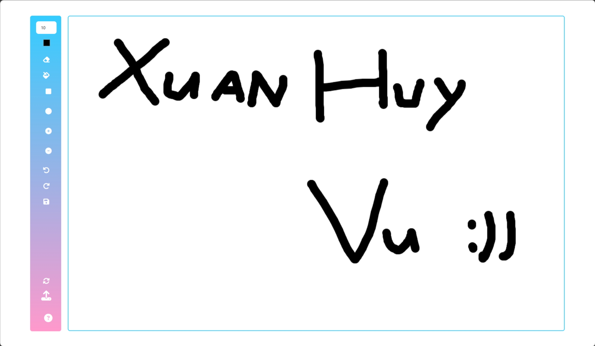
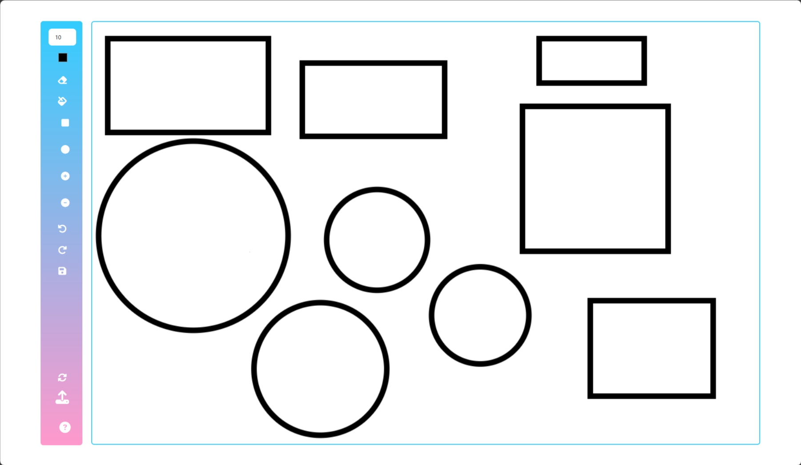
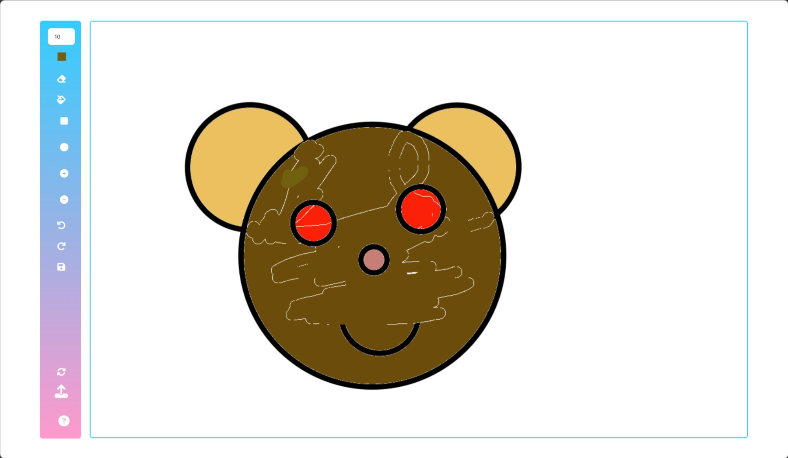
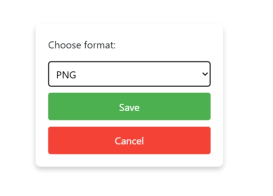

# Paint

## Basic Drawing Tools

### 1.	Eraser Tool:
✅ Remove parts of the drawing with adjustable size.
 
✅	Toggle between eraser and pen modes.

### 2.	Shape Tools:
✅	Draw basic shapes like rectangles and circles. 
✅Option to adjust size, fill color, and border color.

### 3.	Fill Tool:
✅	Fill enclosed areas with a selected color.

## Canvas Management
### 1.	Clear Canvas:
✅	Clear the entire canvas with a single button click (🔄)

### 2.	Undo/Redo:
✅	Undo and redo recent actions to correct mistakes.

### 3.	Save/Export:
✅ Save the canvas as an image file (SVG, PNG, JPEG). 
✅	Option to choose the file format.

### 4.	Upload Image:
✅	Upload an image to the canvas (⬆️)

## Interaction and Customization

### 1.	Zoom In/Out:
✅	Zoom in and out on the canvas for detailed work (➕ ➖)

### 3.	Color Picker:
✅	Choose colors from a color palette or input custom colors.

### 4.	Brush Size Adjuster:
✅	Change the size of the brush or pen tool.

## User Interface Enhancements

### 1.	Help and Tutorials:
✅	Provide instructions or tutorials for using different tools and features.
